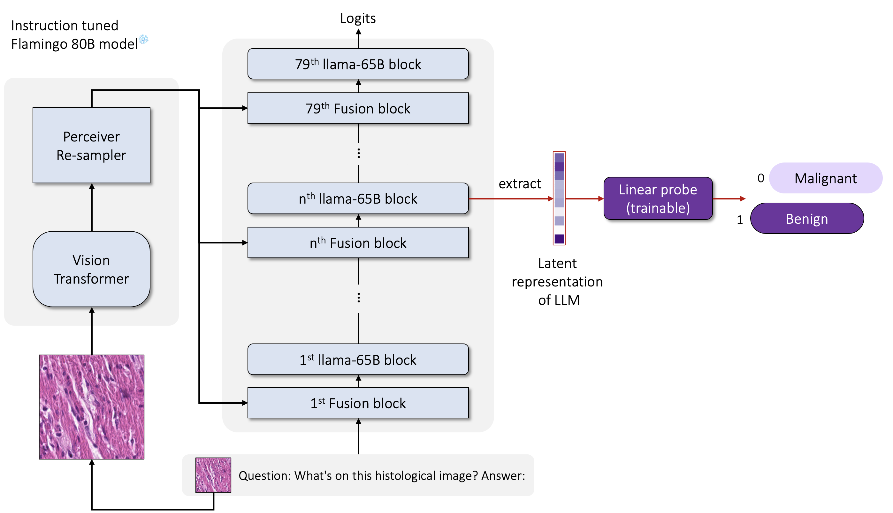
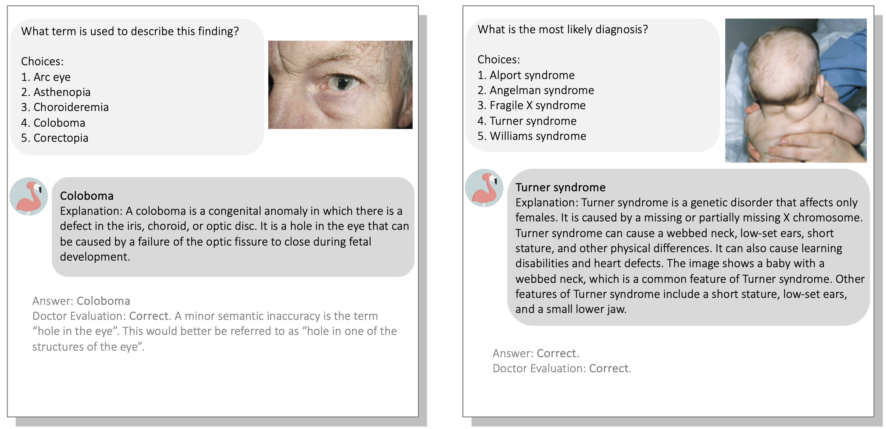

# Multimodal Large Language Models are Generalist Medical Image Interpreters
<details>
<summary>
  <b>Multimodal Large Language Models are Generalist Medical Image Interpreters</b>, medRxiv (2023). 
  <a href="https://www.medrxiv.org/content/10.1101/2023.12.21.23300146v4" target="blank">[Paper]</a>
	<br><em><a href="https://scholar.google.com/citations?hl=en&user=Hxm_OpAAAAAJ">Tianyu Han*</a>, <a href="https://scholar.google.com/citations?user=n-AEUgsAAAAJ&hl=en">Lisa C. Adams*</a>, <a href="https://orcid.org/0000-0002-5267-9962">Sven Nebelung</a>, <a href="https://orcid.org/0000-0002-3730-5348">Jakob Nikolas Kather</a>, <a href="https://scholar.google.com/citations?user=wIEgwbkAAAAJ&hl=en">Keno K. Bressem*</a>, and <a href="https://scholar.google.de/citations?user=dlbH2gMAAAAJ&hl=de">Daniel Truhn*</a></em></br>
</summary>

```bash
Han, T., Adams, L. C., Nebelung, S., Kather, J. N., Bressem, K. K., & Truhn, D. (2023). Multimodal Large Language Models are Generalist Medical Image Interpreters. medRxiv, 2023-12.
```
</details>


This repository contains code to probe and evaluate the multimodal large language models (LLMs) for their ability to interpret medical images in pathology, dermatology, ophthalmology, and radiology - focusing on two use cases within each discipline.

## Dependencies
To clone all files:

```git clone https://github.com/peterhan91/Multimodal-Probes```

To install Python dependencies:

```pip install -r requirements.txt```

## Main question: Do large vision-language models, e.g., Flamingo-80B, understand medical data?
<details>
  <summary>
	  <b>Abstract</b>
  </summary>

1. **Background** Recent developments in Vision-Language Models (VLMs) offer a new opportunity for the application of AI systems in healthcare. We aim to demonstrate the
effectiveness of these general-purpose, large VLMs in interpreting medical images across key medical subspecialties—pathology, dermatology, ophthalmology, and radiology—without
the need for specialized fine-tuning. 
2. **Methods** We conducted a cross-sectional study to analyze image interpretation of large VLMs, focusing on Flamingo-80B, Flamingo-9B, and an OpenAI CLIP model. The study involved eight clinical tasks (T) across various medical specialties, utilizing 11 medical image datasets released between 2015 and 2022. These tasks include the classification of colorectal tissue, skin lesions, diabetic retinopathy, glaucoma, chest radiographs, and osteoarthritis. Additionally, 931 clinical cases from the NEJM Image Challenge (2005-2023) were evaluated to assess the VLMs' performance on clinical vignette questions. The primary outcomes were measured by F1 scores and the area under the receiver operating curve (AUC). 
3. **Results**  In our colorectal cancer (CRC) study (T1), we analyzed 107,180 histological images from 136 patients. In the pan-cancer study (T2), we examined 7,558 images from 19 organs. The Flamingo-80B model proved superior in identifying tissue types, outperforming CLIP representations and other models in CRC (F1 score: 0.892 vs 0.764) and pan-cancer cohorts (0.870 vs 0.797, P<.001). Importantly, Flamingo-80B also outperformed a domain-specific foundation model, which was pre-trained on Twitter, with an F1 score of 0.892 vs 0.877. In the study of pigmented skin lesions (T3) involving 11,720 images and melanoma (T4) with 33,126 images from 2,056 patients, Flamingo-80B also demonstrated higher accuracy, as shown by its AUC scores (average over skin lesions: 0.945 vs 0.892; melanoma: 0.885 vs 0.834, P<.001). In ophthalmology tasks (T4 & T5) involving over 44,350 patients for diabetic retinopathy (DR) and 57,770 for glaucoma, it significantly surpassed the baseline models (DR: 0.803 vs 0.725; glaucoma: 0.868 vs 0.716, P<.001). For chest radiographic conditions (T7) with 67,247 participants and osteoarthritis (OA, T8) involving 7,520 patients, Flamingo-80B consistently achieved the highest AUC among all models: Radiographic conditions: 0.781 vs 0.560 and OA: 0.810 vs 0.714, respectively.
4. **Conclusions** Our results show that non-domain-specific, publicly available vision-language models effectively analyze diverse medical images without fine-tuning, challenging the need for task-specific models.
</details>

## Evidence 1: NEJM Image Challenge benchmark
Flamingo-80B can correctly answer and reason over 40% of complex clinical questions presented in the NEJM Image Challenge.



We provide our benchmarking script for the NEJM Image Challenge. 
```bash
nejm_image_challenge/nejm_test.py
```

## Evidence 2: Probing experiments
### Medical Imaging Datasets
1. **Histopathology datasets** Download images come from [Kather Colon] https://zenodo.org/record/1214456 and [PanNuke] https://warwick.ac.uk/fac/cross_fac/tia/data/pannuke. Preprocessing images and labels from PanNuke following the <a href="https://github.com/PathologyFoundation/plip/blob/f010f3d0bef20f4e8cc64cc26c301cbd26305fa1/reproducibility/generate_validation_datasets/_dataset_loader.py#L182"> PLIP repo</a>.
2. **Dermatology datasets** Download images come from [ISIC 2018] https://challenge.isic-archive.com/data/#2018 and [ISIC 2020] https://challenge.isic-archive.com/data/#2020.
3. **Ophthalmology datasets** Download images come from [EyePACS Diabetic Retinopathy Detection Challenge] https://www.kaggle.com/c/diabetic-retinopathy-detection/, [AIROGS] https://zenodo.org/records/5793241, [APTOS-2019] https://www.kaggle.com/c/aptos2019-blindness-detection, and [ODIR-2019] https://odir2019.grand-challenge.org/Download/. 
4. **Radiology datasets** Download images come from [OAI] https://nda.nih.gov/oai/query-download, [MOST] https://most.ucsf.edu/multicenter-osteoarthritis-study-most-public-data-sharing, and [PadChest] https://bimcv.cipf.es/bimcv-projects/padchest/. Note: in order to gain access to the data, you must be a credentialed user as defined on [OAI] https://nda.nih.gov/oai and [MOST] https://agingresearchbiobank.nia.nih.gov/. In addition, knee joints were extracted from both datasets using a pretrained Hourglass Network from the <a href="https://github.com/Oulu-IMEDS/KNEEL">KNEEL project</a>.

### Extracting Activations from Vision-Language Models
Run the following command to perform activation extraction. 
```bash
python -u activation.py --model HuggingFaceM4/idefics-80b-instruct  --csv_file ./csvs/patho_kather.csv
```
or 
```bash
python -u activation.py --model HuggingFaceM4/idefics-9b-instruct  --csv_file ./csvs/patho_kather.csv
```
### Running Probe Training
Run the following command to train linear probes on layer activations.  
```bash
python eval_torch_ex.py --dataset patho_kather --csv_path csvs/patho_kather.csv --save_path results_80B
```
Due to classes in PadChest are not mutually exclusive, we use a multi-label classification loss function to train the probe. 
```bash
python eval_torch_padchest.py --save_path results_80B
```
Both scripts contain training and evaluating the probe.

### Comparing Probes trained on CLIP features
Run the following command to train linear probes on CLIP features.  
```bash
python clip_ex.py --dataset patho_kather --csv_path csvs/patho_kather.csv
```

## Issues
Please open new issue threads specifying the issue with the codebase or report issues directly to than@ukaachen.de.

## Citation
```bash
@article{han2023multimodal,
  title={Multimodal Large Language Models are Generalist Medical Image Interpreters},
  author={Han, Tianyu and Adams, Lisa C and Nebelung, Sven and Kather, Jakob Nikolas and Bressem, Keno K and Truhn, Daniel},
  journal={medRxiv},
  pages={2023--12},
  year={2023},
  publisher={Cold Spring Harbor Laboratory Press}
}
```

## License
The source code for the site is licensed under the MIT license, which you can find in the `LICENSE` file.
